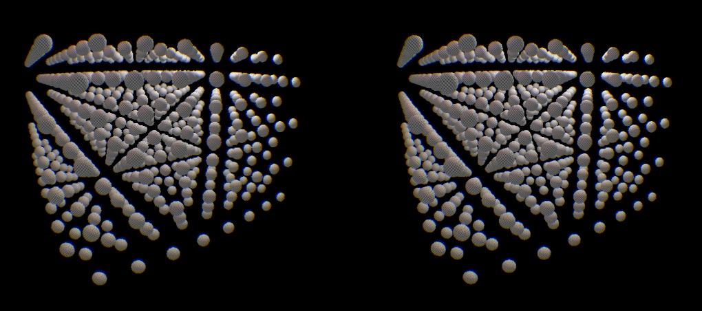
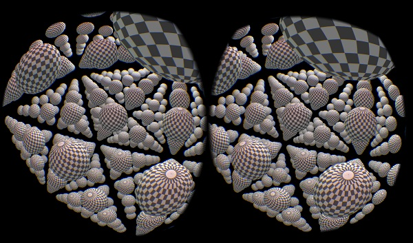
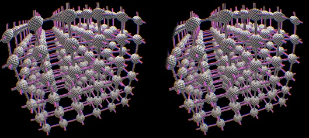
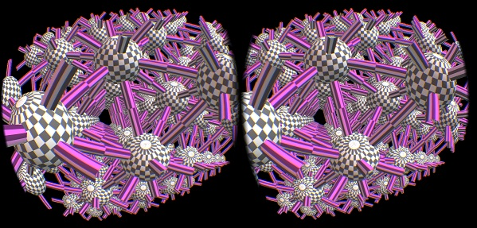

OculusCrystal
=============

Crystal System Visualization Test Project for Oculus Rift

Overview
--------

This project is forked from OculusRoomTiny sample in Oculus SDK 0.4.0.
It does not include all the files in the SDK.
Place the working tree under Samples directory of the SDK so the references
to the resources in the SDK match those of OculusRoomTiny sample.

Screenshots
-----------

Controls
--------

In addition to standard WASD move keys, there are short cut keys available
while looking around with Oculus Rift.

* 'Z' - Move up

* 'X' - Move down

* 'T' - Switches between crystal structures in following set
	* Simple Cubic (e.g. NaCl)
	* Face Centered Cubic
	* Body Centered Cubic
	* Diamond Lattice

* 'Y' - Increase radius of rendered sphere for atoms

* 'H' - Decrease radius of rendered sphere for atoms

* 'V' - Toggle rendering of atoms

* 'B' - Toggle rendering of bonds between atoms

Build
-----

It's confirmed to build with Visual Studio 2013.
It uses a tiny amount of C++11 features, so older versions of Visual Studio
or other compilers may fail to build.

Also, I have only tested the program with Direct3D11.  I'm not sure if the
program runs with OpenGL.

Oculus Rift SDK for Windows can be downloaded from here:

https://developer.oculusvr.com/?action=dl

Running Environment
-------------------

It's only tested on Windows 7 with Oculus Rift DK1.
I have neither tested Linux or Mac OS.

As for DK2, it's not delivered to me yet.
